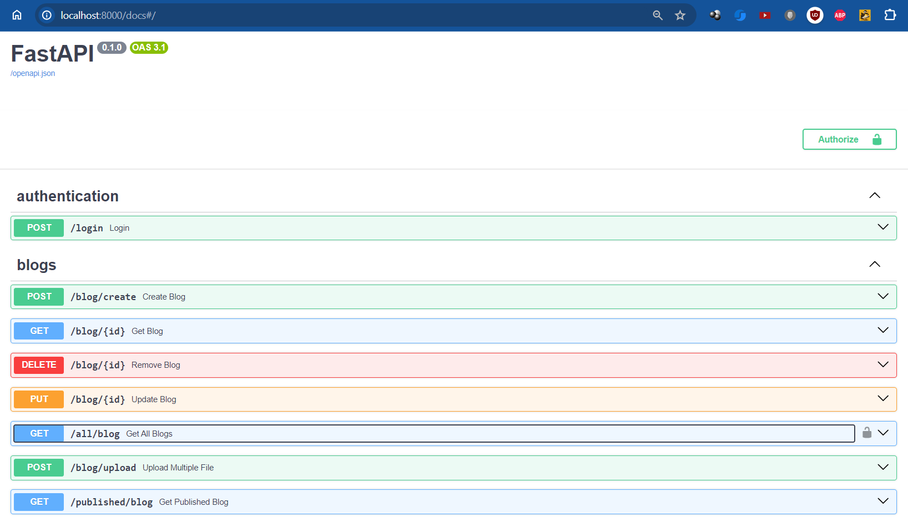

# FastApi Demo App
This is simple rest api developed for the purpose of learning FastApi  
It is based on few youtube tutorials merged together

#### `Features`
* [ ] Get, Post, Form, Delete, Put APIs
* [ ] FastApi routers for segregating endpoints
* [ ] SQL Alchemy for database mapping
* [ ] FastApi middleware for intercepting ang logging each request
* [ ] FastApi security
  

